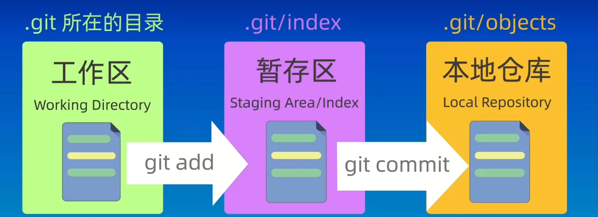
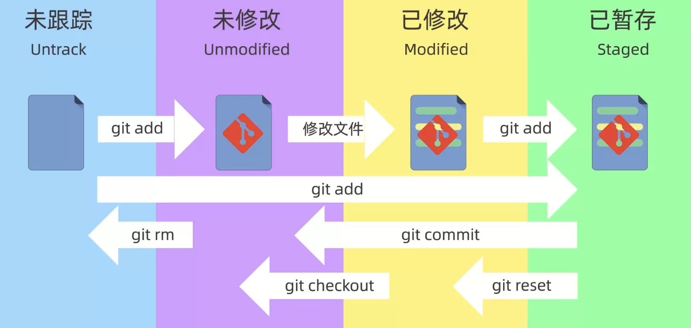
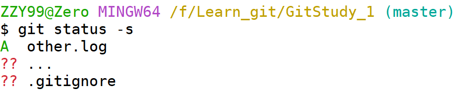

# Git 版本控制工具

## 目录
- [Git 版本控制工具](#git-版本控制工具)
  - [目录](#目录)
  - [版本信息](#版本信息)
  - [配置用户信息](#配置用户信息)
    - [添加用户ID](#添加用户id)
    - [添加用户邮箱](#添加用户邮箱)
    - [查看用户信息](#查看用户信息)
    - [删除用户配置信息](#删除用户配置信息)
  - [仓库](#仓库)
    - [创建`Git`仓库](#创建git仓库)
  - [仓库的基本使用](#仓库的基本使用)
    - [查看仓库状态](#查看仓库状态)
    - [文件管理](#文件管理)


## 版本信息
* 查看当前`Git`工具版本信息  
  
    ```sh
    $ git -v
    git version 2.46.0.windows.1
    ```
## 配置用户信息

> 以下配置以全局配置为例
### 添加用户ID
```sh
git config --global user.name "Zero"
```
### 添加用户邮箱
```sh
git config --global user.email ZZY990613@outlook.com
```
### 查看用户信息
```sh
git config --global --list
```
### 删除用户配置信息
```sh
git config --global --unset user.name
git config --global --unset user.email
```
## 仓库
* `Git`仓库分区结构  

  
* `Git`仓库分区关系  
  
  
### 创建`Git`仓库
- 创建`git`仓库方法：
  
  ```sh
  git init 仓库路径
  ```
- `master`表示当前目录是`git`管理的仓库
- `.git`为隐藏目录，都是`git`仓库的重要组成部分，禁止随意删除或修改
## 仓库的基本使用
### 查看仓库状态
- 查看`工作区`内容  
  
    ```sh
    ls (`Linux`平台下)
    ```
- 查看`暂存区`内容  
    ```sh
    git ls-files
    ```
- 查看`仓库`状态
    ```sh
    git status
    ```
    > 出现以下内容
    ```sh
    On branch master

    No commits yet

    Untracked files:
    (use "git add <file>..." to include in what will be committed)
            READMD.md
            image-1.png
            image-2.png
            image-3.png
            image.png

    nothing added to commit but untracked files present (use "git add" to track)
    ```
    1. `On branch master`:  
    当前所在的`Git`分支是`master`(或者现在的一些仓库使用 main 作为主分支的名称)
    2. `No commits yet`:  
    这个仓库尚未进行任何提交，意味着这是一个刚初始化的仓库，还没有任何历史记录
    3. `Untracked files`:  
    这些是当前工作区中的文件，但它们还没有被`Git`跟踪
- 简略查看仓库状态
  ```sh
  git status -s
  ```
    
    1. 第一列表示`暂存区`状态  
    2. 第二列表示`工作区`状态
    3. `M`表示该文件进行过修改
    4. `A`表示文件新添加至`暂存区`，即该文件是新增文件，但尚未提交到版本库中
### 文件管理
- 将文件添加至`暂存区`
  ```sh
  git add 文件名称(支持通配符)
  ```
- 将文件从`暂存区`移除
  ```sh
  git rm --cached 文件名称
  git rm --cached -f 文件名称(强行移除文件)
  ```
- 将`暂存区`内容提交至`仓库`
  ```sh
  git commit -m "自定义提交日志"
  ```


[返回目录](#目录)
