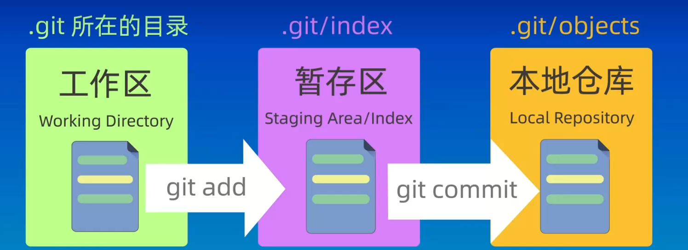
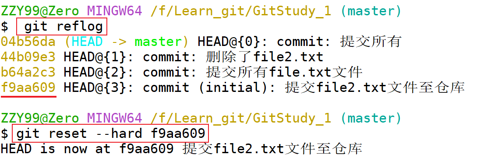
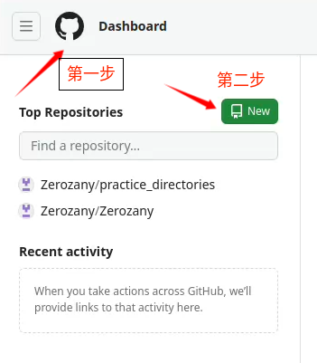
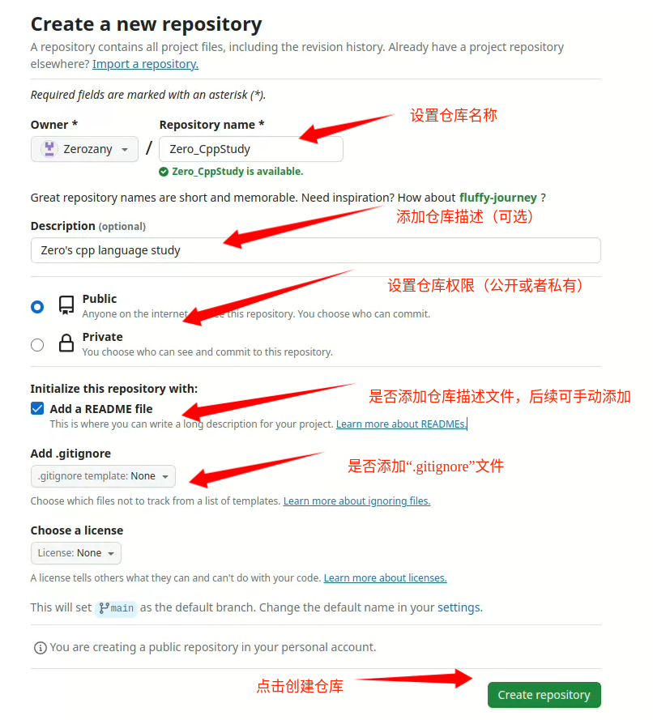
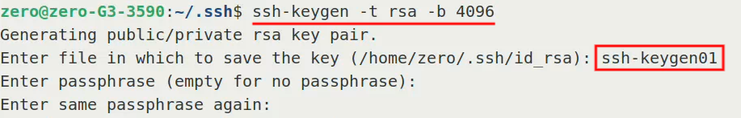
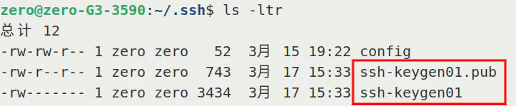

# Git 版本控制工具

## 目录
- [Git 版本控制工具](#git-版本控制工具)
  - [目录](#目录)
  - [版本信息](#版本信息)
  - [配置用户信息](#配置用户信息)
    - [添加用户ID](#添加用户id)
    - [添加用户邮箱](#添加用户邮箱)
    - [查看用户信息](#查看用户信息)
    - [删除用户配置信息](#删除用户配置信息)
  - [仓库](#仓库)
    - [创建`Git`仓库](#创建git仓库)
  - [仓库的基本使用](#仓库的基本使用)
    - [查看文件状态](#查看文件状态)
    - [文件管理](#文件管理)
  - [仓库管理](#仓库管理)
    - [查看提交记录](#查看提交记录)
    - [版本回溯](#版本回溯)
  - [使用`GitHub`管理仓库](#使用github管理仓库)
    - [在`GitHub`上创建仓库](#在github上创建仓库)
    - [配置`SSH`密钥](#配置ssh密钥)


## 版本信息
* 查看当前`Git`工具版本信息  
  
    ```sh
    $ git -v
    git version 2.46.0.windows.1
    ```
## 配置用户信息

> 以下配置以全局配置为例
### 添加用户ID
```sh
git config --global user.name 用户ID
```
### 添加用户邮箱
```sh
git config --global user.email 用户邮箱
```
### 查看用户信息
```sh
git config --global --list
```
### 删除用户配置信息
```sh
git config --global --unset user.name 
git config --global --unset user.email 
```
## 仓库
* `Git`仓库分区结构  

  
* `Git`仓库分区关系  
  
  
### 创建`Git`仓库
- 创建`git`仓库方法：
  
  ```sh
  git init 仓库路径
  ```
- `master`表示当前目录是`git`管理的仓库
- `.git`为隐藏目录，都是`git`仓库的重要组成部分，禁止随意删除或修改
## 仓库的基本使用
### 查看文件状态
- 查看`工作区`内容  
  
    ```sh
    ls (`Linux`平台下)
    ```
- 查看`暂存区`内容  
    ```sh
    git ls-files
    ```
- 查看`仓库`状态
    ```sh
    git status
    ```
    > 出现以下内容
    ```sh
    On branch master

    No commits yet

    Untracked files:
    (use "git add <file>..." to include in what will be committed)
            READMD.md
            image-1.png
            image-2.png
            image-3.png
            image.png

    nothing added to commit but untracked files present (use "git add" to track)
    ```
    1. `On branch master`:  
    当前所在的`Git`分支是`master`(或者现在的一些仓库使用 main 作为主分支的名称)
    2. `No commits yet`:  
    这个仓库尚未进行任何提交，意味着这是一个刚初始化的仓库，还没有任何历史记录
    3. `Untracked files`:  
    这些是当前工作区中的文件，但它们还没有被`Git`跟踪
- 简略查看仓库状态
  ```sh
  git status -s
  ```
    
    1. 第一列表示`暂存区`状态  
    2. 第二列表示`工作区`状态
    3. `M`表示该文件进行过修改
    4. `A`表示文件新添加至`暂存区`，即该文件是新增文件，但尚未提交到版本库中
### 文件管理
- 将文件添加至`暂存区`
  
  ```sh
  git add 文件名称(支持通配符)
  ```
- 将文件从`暂存区`移除(`工作区`保留)
  
  ```sh
  git rm --cached 文件名称
  git rm --cached -f 文件名称(强行移除文件)
  ```
- 将文件从`暂存区`和`工作区`移除  
  ```sh
  git rm 文件名称
  ```
- 将`暂存区`内容提交至`仓库`
  
  ```sh
  git commit -m "自定义提交日志"
  ```
## 仓库管理
### 查看提交记录
- 详细模式
  
  ```sh
  git log
  ```
- 简介模式
  ```sh
  git log --oneline
  ```
### 版本回溯

- 查看历史操作记录
  
  ```sh
  git reflog
  ```
- 指定版本进行回溯  
  
  

## 使用`GitHub`管理仓库
### 在`GitHub`上创建仓库
1. 注册并打开[GitHub官网](https://github.com)
2. 创建仓库  
   
   
3. 初始化仓库信息
   
   
### 配置`SSH`密钥
1. 进入`.ssh`目录
   
   ```sh
   cd ~
   cd .ssh (不存在则创建后再进入`mkdir .ssh`)
   ```
2. 创建密钥
   
   ```sh
   ssh-keygen -t rsa -b 4096
   ```  
   > -t ：指定密钥类型  
   > -b ：指定密钥位数
3. 配置密钥  
   
   
   - 输入密钥ID
   - 设置密钥密码
   - 再次确认密码
4. 查看生成密钥  
   
   
   - ssh-keygen01 ：私钥文件(私密)
   - ssh-keygen01.pub：公钥文件，上传至`GitHub`
5. 在`.ssh`目录下创建`config`文件，并写入以下内容  
    ```sh
    Host github.com
        HostName github.com
        User git
        IdentityFile ~/.ssh/ssh-keygen01 (私钥路径)
    ```


[返回目录](#目录)
